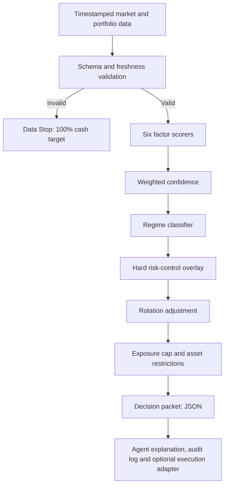

# Architecture

The reference package ends at the decision packet. Exchange execution is intentionally separated so that credentials, venue rules and operational controls are not mixed with strategy logic.
